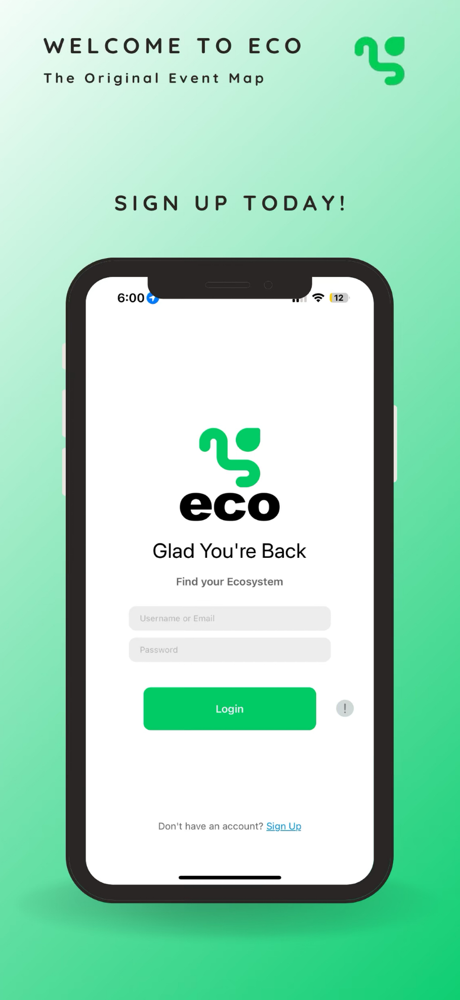
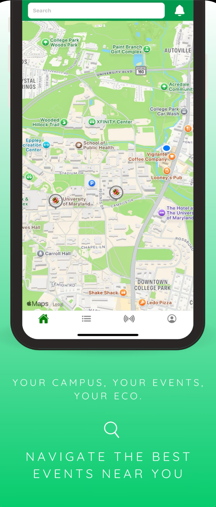
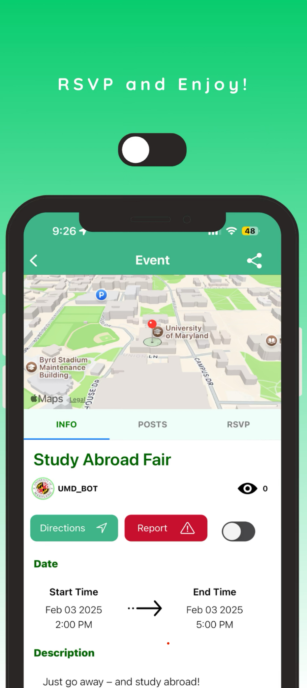
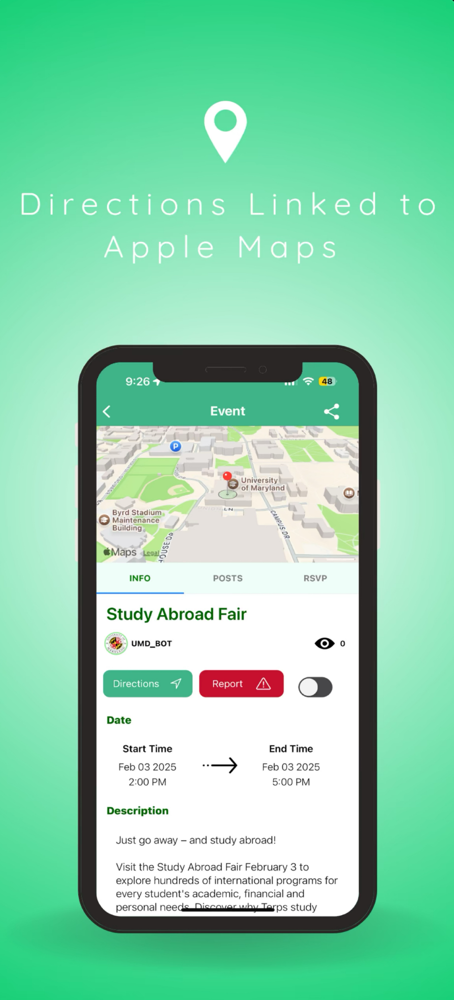
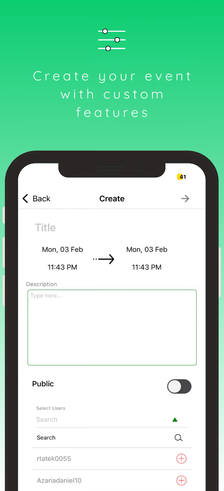

# Eco – Local Event Discovery App (Showcase)

**Eco** is a location-based mobile app that helps users discover social events happening nearby. Designed for spontaneity and real-world connection, Eco lets users find and share events in real time through a simple map interface and user-friendly feed.

> 📱 Co-founded, designed, and engineered by [Your Name]  
> 🚀 Available on the App Store  

---

## 🌟 Overview

Eco was created with the goal of helping people connect with local communities and happenings — from open mic nights and pop-up markets to spontaneous meetups and campus events.

We wanted it to feel alive and hyper-local. Unlike general-purpose event platforms, Eco focuses on immediacy, proximity, and simplicity.

---

## 💡 Key Features

- 🔍 **Real-Time Event Discovery**  
  Find events around you using a dynamic location-aware map.

- 🧭 **Minimal Account Setup**  
  Users can jump in quickly, with secure login and minimal friction.

- 🗺️ **Interactive Feed**  
  See what’s trending nearby — not just what’s popular globally.

- ✨ **Clean, Intuitive UI**  
  Built to feel fast, responsive, and inviting, especially for first-time users.

---

## 🔧 Technologies Used

### 📱 Mobile App
- **React Native** — cross-platform mobile development
- **Firebase** — user auth, real-time database, storage, hosting
- **JavaScript / Node.js** — server-side logic and tooling

### 🌐 Website ([geteco.app](https://geteco.app))
- **HTML / CSS / JavaScript** — hand-written, fully responsive
- **Bootstrap** — design system support
- **Firebase Hosting** — live deployment
- **Photoshop / Premiere Pro** — all visual assets and promotional videos were custom-designed

---

## 🎨 My Role

I led the entire front-end and back-end implementation of the Eco platform. This included:

- Developing the **entire mobile UI** using React Native
- Implementing backend logic for **authentication**, **event creation**, and **data retrieval**
- Managing **Firebase Firestore** for structured, scalable event storage
- Designing and building the **official website** from scratch (HTML/CSS/JS) including:
  - Custom graphics, animations, and layout
  - Responsive design for all screen sizes
  - Embedded promotional videos made using Adobe Premiere Pro

---

## 📸 Screenshots

---

## 🔗 Link

- 🌐 [Website: geteco.app](https://geteco.app)

---

## 🙋‍♂️ Contact

Want to learn more about the project, the tech, or the design process?  
Feel free to reach out on [LinkedIn](https://linkedin.com/in/rgaffere) or email me directly.

---

## ✍️ Authors

- **Ryan G**
- **Nahom A**
